Creating a New Learning Environment
===================================

This tutorial walks through the process of creating a learning environment in Unreal Engine from scratch. By the end,
you'll have an environment where an agent controls a sphere to reach a target while avoiding falling off a platform.

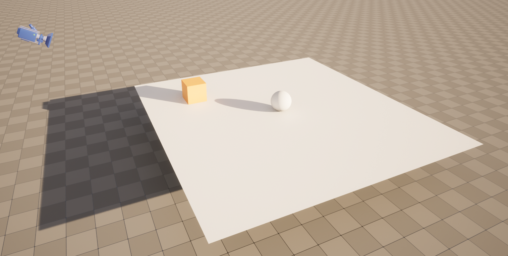

Prerequisites
-------------

Before starting, ensure you have:

1. Unreal Engine version 5.2 or higher installed.
2. The UnrealMLAgents plugin set up and enabled. Follow the :doc:`Installation <installation>` guide if you haven't done this yet.

Overview
--------

Using UnrealMLAgents in your project involves these steps:

1. **Create the Environment**: Design the level, including the floor, target, and agent actor. An environment can range
   from a simple physical simulation containing a few objects to an entire game or ecosystem.
2. **Implement the Agent**: Define the agent’s behavior, including observations, actions, and rewards. The agent
   interacts with the environment and learns based on rewards provided for specific actions.
3. **Group and Organize**: Use an Actor or Blueprint to group the environment elements into a cohesive unit. In Unreal,
   we attach an Agent component to the Actor or Character we want to use as the learning agent. To learn more about
   Unreal Engine, refer to the `Unreal Engine Documentation <https://dev.epicgames.com/documentation/en-us/unreal-engine/unreal-engine-5-5-documentation>`_.

Set Up the Unreal Project
-------------------------

1. Launch Unreal Engine and create a new Blank C++ project. Note: While this is a C++ project, you can still create
   Blueprints and use them alongside C++ classes. This tutorial will contain both blueprints-only and C++ versions.
2. Name the project "RollerSphere” or any name of your choice.
3. Enable the UnrealMLAgents plugin in **Edit -> Plugins**.

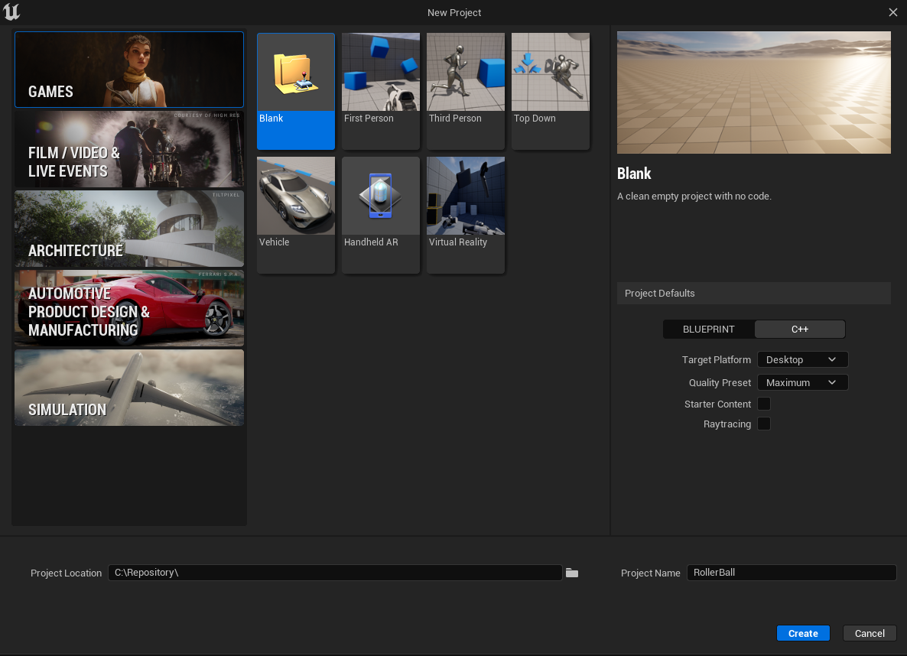

Your Unreal project should contain the plugin enabled like this:

Create the Environment
-----------------------

Create the Floor
~~~~~~~~~~~~~~~~

1. Click on the **Cube** above the viewport, **Shapes -> Plane**.
2. Name the Actor "Floor”.
3. Set the Transform values:

   - Location: `(0, 0, 200)`
   - Rotation: `(0, 0, 0)`
   - Scale: `(12, 12, 12)`

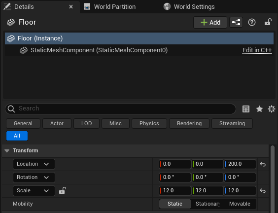

Add the Target Cube
~~~~~~~~~~~~~~~~~~~

1. Click on the **Cube** above the viewport, **Shapes -> Cube**.
2. Name the Actor "Target”.
3. Set the Transform values:

   - Location: `(300, 200, 250)`
   - Rotation: `(0, 0, 0)`
   - Scale: `(1, 1, 1)`

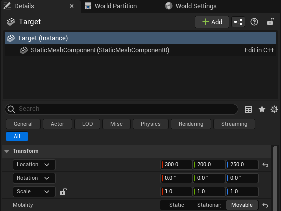

Add the Agent Sphere
~~~~~~~~~~~~~~~~~~~~

Instead of adding a basic sphere actor, create a Blueprint class for the agent.

1. Right-click in the **Content Browser** and select **Blueprint Class -> Actor**.
2. Name the Blueprint "BP_RollerBall”.
3. Open the Blueprint Editor for BP_RollerBall and add the following components:
   - **Sphere Component**: Represents the agent visually. Set its physics properties:

      - Enable physics and set the mass to 0.1 kg.

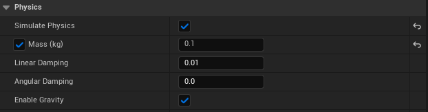

4. Place the BP_RollerBall Blueprint in the level at `(0, 0, 250.5)`.
5. Set the Auto Possess Player to **Player 0** in the **Details** panel.

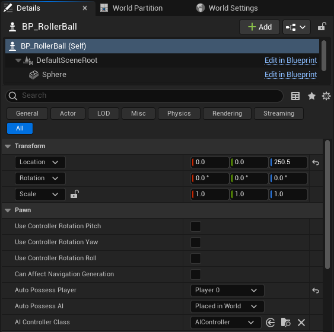

Add the camera
~~~~~~~~~~~~~~

1. Click on the **Cube** above the viewport, **All classes -> Camera Actor**.
2. Name the Actor "CameraActor”.
3. Set the Transform values:

   - Location: `(900.00, 0, 650)`
   - Rotation: `(0, -30, -180)`
   - Scale: `(1, 1, 1)`

By default Unreal Engine will set an initial camera at start. We need to replace this camera
by the one we just created. For that we need to set the view target at the level blueprint.

Open the level blueprint this way:

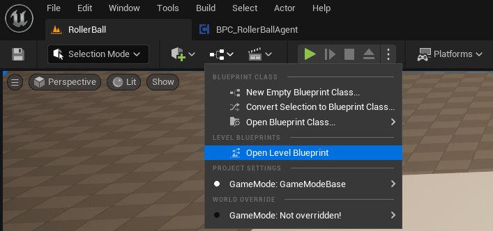

Set the view target to the camera we just created:

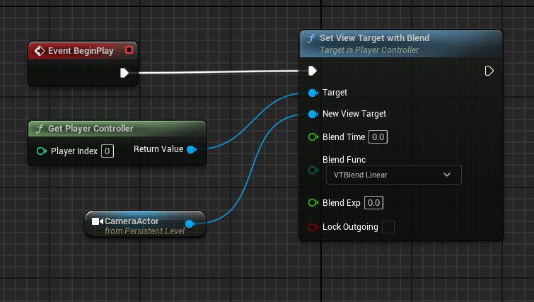

.. note::

   To create a reference to the Camera Actor. Select in the level the camera, go in the blueprint,
   right-click, and select "Add reference to CameraActor".

Group into Training Area
~~~~~~~~~~~~~~~~~~~~~~~~

Group objects by highlighting them in the **World Outliner** and adding them to a new folder.

1. In the outliner, Right-click and select **Create Folder**. Name the folder "TrainingArea".
2. Highlight the Floor, Target, and BP_RollerBall in the **Outliner** and drag/drop to the "TrainingArea" folder.

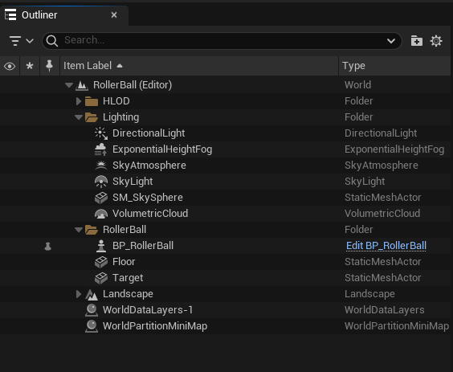

Implementing the Agent
----------------------

Create the Agent Component
~~~~~~~~~~~~~~~~~~~~~~~~~~

In this section, we will create the Agent Component and attach it to our BP_RollerBall. This component will handle
all the agent’s interactions with the environment. By design, the Agent is implemented as a Component to allow
attachment to both Actors and Characters, enabling flexibility.

.. tab-set::

   .. tab-item:: Blueprint

      1. Right-click in the **Content Browser** and select **Blueprint Class -> Actor Component**.
      2. In the search bar, type "Agent" and select it.
      3. Name the new Blueprint Component "BPC_RollerAgent".

      .. image:: _images/create_agent_component.png
         :alt: Create Blueprint Agent Component

   .. tab-item:: C++

      C++ Content

Add the Agent Component to BP_RollerBall:

1. Open the **BP_RollerBall** Blueprint.
2. In the **Components** section, click **Add** and search for "BPC_RollerAgent (Blueprint)" or "RollerAgent (C++)".
3. Add this component to the BP_RollerBall Blueprint.

So far, we have set up the environment and the agent component. Next, we will implement the logic that allows the agent
to learn and interact with the environment. Specifically, we will extend three key methods:

- **OnEpisodeBegin**: Resets the environment and initializes variables for a new episode.
- **CollectObservations**: Collects data about the environment for the agent to process.
- **OnActionReceived**: Applies actions taken by the agent and assigns rewards.

These methods form the foundation of reinforcement learning for the agent.

Initialization and Resetting the Agent
--------------------------------------

The process of training in the UnrealMLAgents Toolkit involves running episodes where the Agent (Sphere) attempts to
solve the task. Each episode lasts until the Agent solves the task (i.e., reaches the target cube), fails (falls off the
platform), or times out (takes too long to solve or fail the task). At the start of each episode, **OnEpisodeBegin** is
called to set up the environment for a new episode. Typically, the scene is initialized in a random manner to enable
the agent to learn to solve the task under a variety of conditions.

In this example, each time the Agent (Sphere) reaches its target (Cube), the episode ends, and the target (Cube) is
moved to a new random location. If the Agent rolls off the platform, it will be put back onto the floor. These tasks
are all handled in **OnEpisodeBegin**.

To move the target (Cube), we need a reference to its Transform, which stores an Actor's position, orientation,
and scale in the 3D world. In Unreal, you can achieve this by adding a public property for the Target's Transform
in the Agent Component or Blueprint. This allows you to manipulate the target's location dynamically during each episode.

To reset the Agent's velocity (and later to apply force to move the Agent), you need a method to
reset its movement directly. In Unreal, this is achieved by manipulating the velocity of the Sphere Component.
Specifically, you can set the velocity vector to zero in the **OnEpisodeBegin** method. This ensures the agent
starts each episode with no residual momentum.

Before we dig into the **OnEpisodeBegin** method, let's set up the references to the owner.

.. tab-set::

   .. tab-item:: Blueprint

      In Blueprint, you need to first create a RollerBallRef variable of type BP_RollerBall.
      To add a variable, in the variables section of the Agent Component, click on the +Variable button
      and set the variable type to BP_RollerBall. Then you can set the variable on the Event Begin Play:

      .. image:: _images/bp_roller_ball_reference.png
         :alt: Create references to target in Blueprint

   .. tab-item:: C++

      .. image:: _images/bp_roller_ball_reference_c++.png
         :alt: Create reference to target in C++

Implementing the **OnEpisodeBegin** method in the Agent Component:

.. tab-set::

   .. tab-item:: Blueprint

      .. image:: _images/event_on_episode_begin_blueprint.png
         :alt: On episode begin in Blueprint

   .. tab-item:: C++

      .. image:: _images/event_on_episode_begin_c++.png
         :alt: On episode begin in C++

You might wonder why we add the RollerBall's start position to the Cube's position.
This ensures that the Cube spawns relative to the Sphere's position, regardless of where it is in the world.

Next, let's implement the `Agent.CollectObservations(VectorSensor sensor)` method.

Observing the Environment
-------------------------

The Agent sends the information it collects to the Brain, which uses it to make decisions. When training the Agent (or
using a trained model), this data is fed into a neural network as a feature vector. To enable the Agent to successfully
learn a task, it is critical to provide accurate and relevant information. A good rule of thumb is to include all data
necessary to calculate an analytical solution to the problem.

In this example, the information our Agent collects includes:

- The position of the target (the cube).
- The position of the agent itself relative to it's start position.
- The velocity of the agent.
- The distance of the sphere relative to its start position.
- The distance between the sphere and the target.

This additional information helps the Agent learn to control its movement effectively, avoid overshooting the target,
and understand its spatial relationship within the environment.

.. tab-set::

   .. tab-item:: Blueprint

      To facilitate the implementation in Blueprint and to make it clearer, we will need to create two functions:
         - **GetTargetRelativePosition**: Calculates the relative position between the target and the sphere's start position.
         - **GetRelativePositionToStart**: Calculates the relative position between the sphere and its start position.

      **GetTargetRelativePosition()**:

         1. Open the **BPC_RollerAgent** Blueprint.
         2. Create a new function named "GetTargetRelativePosition".
         3. Add Return Node with output type `Vector` named "Position"

      .. image:: _images/get_target_relative_position.png
         :alt: Get target relative position in Blueprint

      **GetRelativePositionToStart()**:

         1. Open the **BP_RollerBall** Blueprint.
         2. Create a new function named "GetRelativePositionToStart".
         3. Add Return Node with output type `Vector` named "Position"

      .. image:: _images/get_relative_position_to_start.png
         :alt: Get relative position to start in Blueprint

      The full implementation of the **Agent.CollectObservations(VectorSensor sensor)** method in Blueprint:

      .. image:: _images/collect_observation_blueprint.png
         :alt: Collect observations in Blueprint

   .. tab-item:: C++

      .. image:: _images/collect_observation_c++.png
         :alt: Collect observations in C++

Taking Actions and Assigning Rewards
------------------------------------

The final part of the Agent code is the **Agent.OnActionReceived()** method, which receives actions and assigns rewards.

Actions
~~~~~~~

To solve the task of moving towards the target, the Agent (Sphere) needs to use discrete actions to move along
the `X` and `Y` directions. As such, the agent requires 5 actions:
- `-X`: Move left by applying force along the negative X-axis.
- `+X`: Move right by applying force along the positive X-axis.
- `-Y`: Move down by applying force along the negative Y-axis.
- `+Y`: Move up by applying force along the positive Y-axis.
- No movement

Using discrete actions reduces the complexity of the neural network since it only needs to evaluate a limited set
of predefined actions for a given observation. This approach simplifies the decision-making process for the agent
while still allowing effective control of its movement.

In Unreal, we can apply forces to the Sphere Component to enable movement. Each discrete action corresponds
to a specific force application:

- Action `0`: No movement.
- Action `1`: Apply force of `1` along the negative X-axis.
- Action `2`: Apply force of `1` along the positive X-axis.
- Action `3`: Apply force of `1` along the negative Y-axis.
- Action `4`: Apply force of `1` along the positive Y-axis.

Mapping these discrete actions to movement logic reduces complexity and ensures clear action-to-effect relationships.
This logic is implemented in **OnActionReceived()**, where the action index is mapped to the respective force
vector applied to the Sphere Component.

Rewards
~~~~~~~

Reinforcement learning requires rewards to signal which decisions are good and which are bad. The learning algorithm
uses the rewards to determine whether it is giving the Agent the optimal actions. You want to reward an Agent for
completing the assigned task. In this case, the Agent is given a reward of 1.0 for reaching the target cube.

Additionally, if the Agent falls off the platform, it is given a small malus of -0.1. This penalty helps the Agent
understand that falling off the platform is undesirable and should be avoided.

Rewards are assigned in **OnActionReceived()**. The Agent calculates the distance to detect when it reaches the target.
When it does, the code calls **Agent.SetReward()** to assign a reward of 1.0 and marks the agent as finished by calling
**EndEpisode()**. If the Agent falls off the platform, the malus is applied, and **EndEpisode()** is also triggered to
restart the episode.

OnActionReceived()
~~~~~~~~~~~~~~~~~~

With the action and reward logic outlined above, the final version of OnActionReceived() looks like:

.. tab-set::

   .. tab-item:: Blueprint

      For a matter of simplification we have add a function to apply the force to the sphere.
      This method is called ApplyForce and takes an integer as input to determine the direction of the force.

      .. image:: _images/apply_force_blueprint.png
         :alt: Apply force in Blueprint

      As you can see this method use a ForceMultiplier variable to determine the force to apply to the sphere.
      ForceMultiplier must be set as Public in the Blueprint to be able to set it from the Inspector window.
      To do that, on the right side of the variable, click on the eye icon to make it public.

      PositionX and PositionY are two variables that store the position of the sphere in the X and Y axis.
      These variables are local to the method and will be reset each time we call the method.
      To add local variables, click on the "+" next to LOCAL VARIABLES and set the variable type to Float.

      Now here is the full implementation of the **OnActionReceived()** method in Blueprint:

      .. image:: _images/on_action_received_blueprint.png
         :alt: On action received in Blueprint

   .. tab-item:: C++

      C++ Content

.. note::

   Since ForceMultiplier is public, you can set the value from the Inspector window.
   Select the sphere in the level, and in the Details panel, you will see the Force Multiplier variable.

Final Agent Setup in Editor
---------------------------

Now that all the environment components and Agent setup are in place, it is time to configure the **BP_RollerBall** Blueprint to finalize the setup.
This involves adding and configuring the necessary components for decision-making and behavior.

1. Open the **BP_RollerBall** Blueprint.
2. Add the **DecisionRequester Component**:
   - Set the **Decision Period** to `10` to define how often decisions are requested from the agent.
3. Add the **BehaviorParameters Component**:
   - Set **Vector Observation Space Size** to `10`. This includes all the observations collected by the agent.
   - Set **Discrete Actions** with 1 branch and 5 actions corresponding to the agent's possible movements (`0` for no movement, `1-4` for movement in specific directions).

With these components added, your agent is fully configured and ready for testing and training.
Here is what is should look like for every components:

BehaviorParameters Component:
~~~~~~~~~~~~~~~~~~~~~~~~~~~~~~

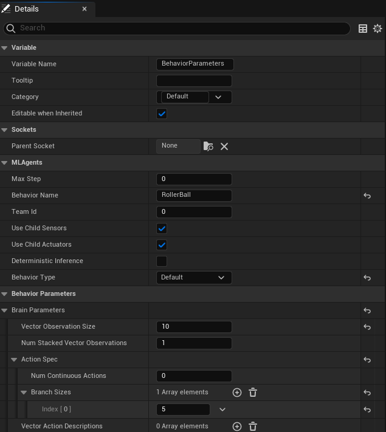

DecisionRequester Component:
~~~~~~~~~~~~~~~~~~~~~~~~~~~~

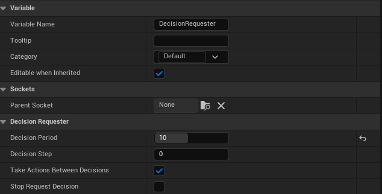

Finally what the BP_RollerBall Components section should look like:

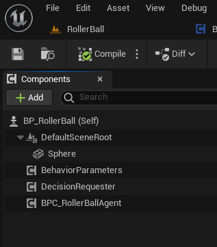

Testing the Environment
-----------------------

It is always a good idea to first test your environment by controlling the Agent using the keyboard.
To do so, you will need to extend the **Heuristic()** method in the RollerAgent class. For this example,
the heuristic will generate an action corresponding to the values of the "Horizontal" and "Vertical" input
axis (which correspond to the keyboard arrow keys).

In unreal things are not as straightforward as in Unity in order to get input from a controller,
but we can still achieve the same result.

Input Mapping
~~~~~~~~~~~~~

In the content drawer, under Content, create a new folder called Inputs.
In that folder, create an Input Mapping Context named IMC_Default:

1. Right-click in the content drawer.
2. Under Input, select Input Mapping Context and name it IMC_Default.

Next, create an Action Mapping to keep things organized. Create a folder called Actions. In that folder:

1. Right-click in the content drawer.
2. Under Input, select Input Action and name it IA_Move.

At this stage, your content drawer should look like this:

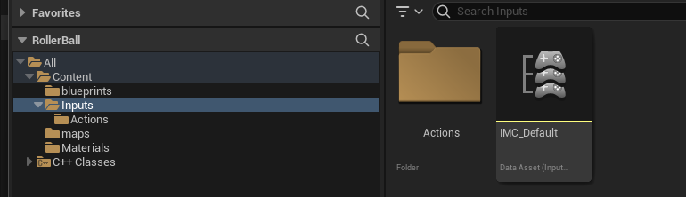

Now, set values in the Input Action. Open IA_Move and configure the following settings:

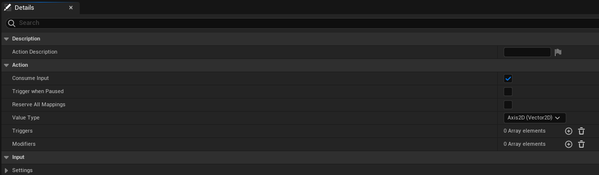

.. note::

   Axis2D (Vector2D) will provide the value of the axis as a 2D vector, including both X and Y axes.

Then open the IMC_Default and set the following values:

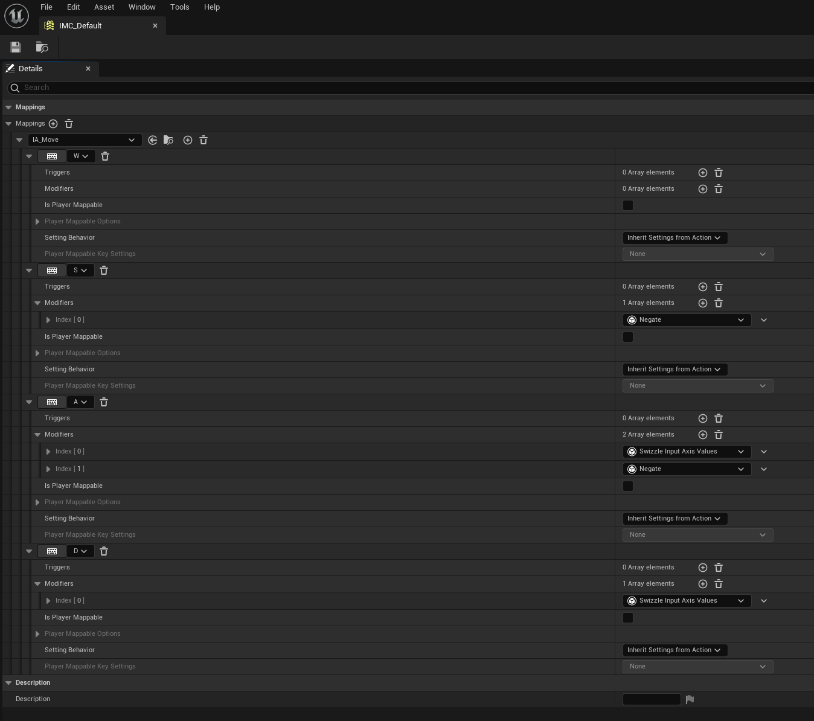

.. note::

   If you want to learn more about `enhanced input`, you should check the
   Unreal documentation: `Enhanced Input <https://dev.epicgames.com/documentation/en-us/unreal-engine/enhanced-input-in-unreal-engine>`_.

Before we jump into the `heuristic()`` method, we need to set our Mapping Context.
To do that, open the BP_RollerBall Blueprint and add the following nodes:

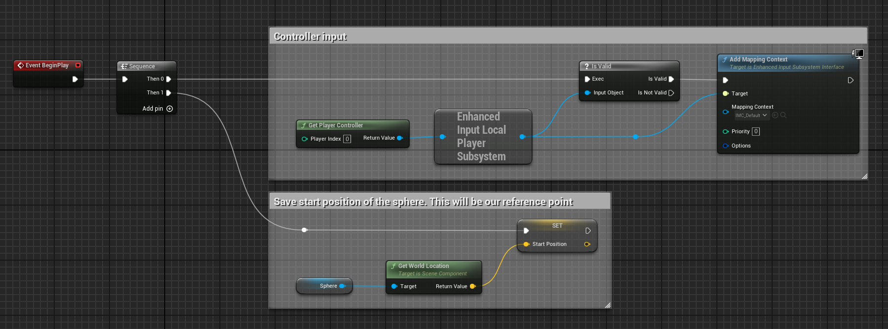

Heuristic Method
~~~~~~~~~~~~~~~~

The heuristic method is a simple way to control the Agent using the keyboard. It is used for testing the environment.
Here are the steps to implement the heuristic method both in Blueprint and C++:

.. tab-set::

   .. tab-item:: Blueprint

      .. note::

         While everything can be done in Blueprint, in some case you will see that the C++ implementation is more efficient.

      .. image:: _images/heuristic_blueprint.png
         :alt: Heuristic in Blueprint

   .. tab-item:: C++

      .. image:: _images/heuristic_c++.png
         :alt: Heuristic in C++

In order for the Agent to use the heuristic, you will need to set the **Behavior Type** to
"Heuristic Only" in the **Behavior Parameters** of the BP_RollerAgent in the Outliner.

Press **Play** to run the scene and use the arrow keys to move the Agent around the platform.
Make sure that there are no errors displayed in the Unreal Editor's Output Log and that the Agent
resets correctly when it reaches its target or falls off the platform.

Training the Environment
-------------------------

The process is the same as described in the :doc:`Getting Started Guide </intro/getting-started>`.

1. Create a configuration file (e.g., `roller_sphere_config.yaml`) in your project’s config folder.
2. Include training parameters such as:

   .. code-block:: yaml

      behaviors:
        RollerBall:
          trainer_type: ppo
          hyperparameters:
            batch_size: 10
            buffer_size: 100
            learning_rate: 3.0e-4
            beta: 5.0e-4
            epsilon: 0.2
            lambd: 0.99
            num_epoch: 3
            learning_rate_schedule: linear
            beta_schedule: constant
            epsilon_schedule: linear
          network_settings:
            normalize: false
            hidden_units: 128
            num_layers: 2
          reward_signals:
            extrinsic:
              gamma: 0.99
              strength: 1.0
          max_steps: 500000
          time_horizon: 64
          summary_freq: 10000

Hyperparameters are explained in the training configuration file documentation: `Unity ML-Agents Training Configuration File <https://github.com/Unity-Technologies/ml-agents/blob/develop/docs/Training-Configuration-File.md>`_.

Since this example creates a very simple training environment with only a few inputs and outputs,
using small batch and buffer sizes speeds up the training considerably. However, if you add more complexity
to the environment or change the reward or observation functions, you might also find that training performs
better with different hyperparameter values. In addition to setting these hyperparameter values, the Agent
DecisionFrequency parameter has a large effect on training time and success. A larger value reduces the number of
decisions the training algorithm has to consider and, in this simple environment, speeds up training.

To train your agent, run the following command before pressing **Play** in the Editor:

.. code-block:: bash

   ue-agents-learn path/to/config/rollerball_config.yaml --run-id=RollerBall

To monitor the statistics of Agent performance during training, use TensorBoard: `Using TensorBoard <https://github.com/Unity-Technologies/ml-agents/blob/develop/docs/Using-Tensorboard.md>`_.

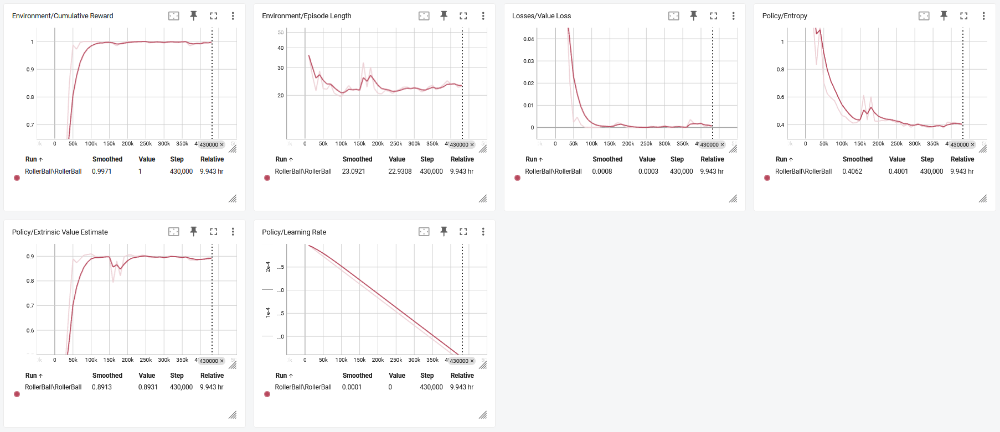

In particular, the `cumulative_reward` and `value_estimate` statistics show how well the Agent
is achieving the task. In this example, the maximum reward an Agent can earn is 1.0,
so these statistics approach that value when the Agent has successfully solved the problem.

Optional: Multiple Training Areas within the Same Scene
-------------------------------------------------------

In many of the example environments, multiple copies of the training area are instantiated in the scene.
This generally speeds up training, allowing the environment to gather many experiences in parallel.
This can be achieved simply by instantiating many Agents with the same Behavior Name.

In Unreal, you can duplicate the **RollerBall** folder you created at the beginning of this
document and make as many copies as you want. Since all positioning logic is related to the
starting position of the ball, duplicating the folder ensures every environment is equal and every
observation is consistent for the neural network. This setup allows the neural network to train effectively across
identical training areas, providing more robust learning data for the Agent.
